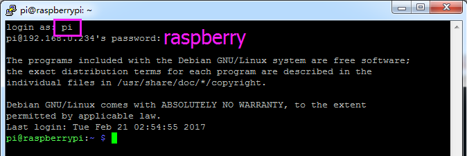

Install the Button Driver
============================

You need to install the button driver before you can use the buttons on the Retro Game HAT.

Insert the SD card into Retro Game HAT, turn the power switch to ON.

Get the IP Address
-----------------------

After the Retro Game HAT is connected to WIFI, we need to get the IP address of it. There are many ways to know the IP address, and two of them are listed as follows.

1.  Checking via the router

If you have permission to log in the router(such as a home network), you can check the addresses assigned to Raspberry Pi on the admin interface of router.

The default hostname of the Retro Game HAT is raspberrypi, and you need to find it. (If you are using ArchLinuxARM system, please find alarmpi.)

1.  Network Segment Scanning

You can also use network scanning to look up the IP address of Raspberry Pi. You can apply the software, Advanced IP scanner and so on.

Scan the IP range set, and the name of all connected devices will be displayed. Similarly, the default hostname of the Retro Game HAT is raspberrypi, if you haven’t modified it.

Use the SSH Remote Control
---------------------------

We can open the Bash Shell of RetroPie by applying SSH. Bash is the standard default shell of Linux. The Shell itself is a program written in C that is the bridge linking the customers and Unix/Linux. Moreover, it can help to complete most of the work needed.

For Linux or/Mac OS X Users
^^^^^^^^^^^^^^^^^^^^^^^^^^^^^^^^^

**Step 1**

Go to **Applications**->\ **Utilities**, find the **Terminal**, and open
it.

.. image:: media/setup2.png
    :width: 600
    :align: center

**Step 2**

Type in **ssh pi@ip_address** . “pi”is your username and “ip_address” is
your IP address. For example:

.. code-block::

    ssh pi@192.168.18.197

**Step 3**

Input”yes”.

**Step 4**

Input the passcode and the default password is **raspberry**.

**Step 5**

We now get the Raspberry Pi connected and are ready to go to the next
step.

.. note::
    When you input the password, the characters do not display on
    window accordingly, which is normal. What you need is to input the
    correct password.

For Windows Users
^^^^^^^^^^^^^^^^^^^^^^^

If you're a Windows user, you can use SSH with the application of some
software. Here, we recommend **PuTTY**.

**Step 1**

Download PuTTY.

**Step 2**

Open PuTTY and click **Session** on the left tree-alike structure. Enter
the IP address of the RPi in the text box under **Host Name (or IP
address)** and **22** under **Port** (by default it is 22).

.. image:: media/setup6.png
    :width: 600
    :align: center

**Step 3**

Click **Open**. Note that when you first log in to the Raspberry Pi with
the IP address, there prompts a security reminder. Just click **Yes**.

**Step 4**

When the PuTTY window prompts “\ **login as:”**, type in
“\ **pi”**\ (the user name of the RPi), and **password: “**\ raspberry”
(the default one, if you haven't changed it).

**Step 5**

Here, we get the Raspberry Pi connected and it is time to conduct the
next steps.

.. note::

    When you input the password, the characters do not display on
    window accordingly, which is normal. What you need is to input the
    correct password.

Install Key Drive
-------------------

When you enter the RetroPie terminal via ssh, enter the following command to download the source code of the button driver.

.. code-block:: python

    git clone https://github.com/sunfounder/retro-game-hat

    cd retro-game-hat/game-hat-button-driver

Install the button driver.

.. code-block:: python

    sudo python3 install.py

After the installation is complete, it is prompted whether to restart, enter Y to confirm.

.. code-block:: python

    Installation finished, do you want to reboot? (y/N) Y
